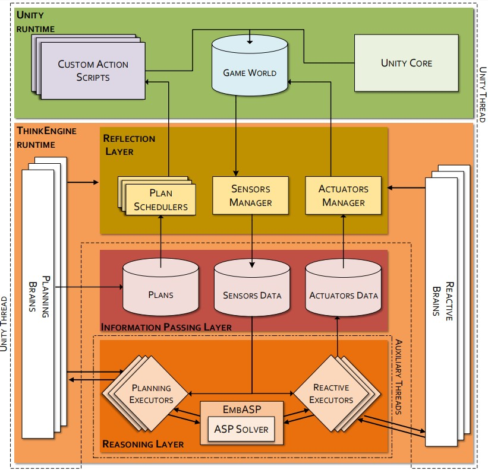

# ThinkEngine
**ThinkEngine** is a [Unity](https://unity.com/) asset that provides an easy integration of an [ASP](https://en.wikipedia.org/wiki/Answer_set_programming) solver in a videogame or other projects developed in Unity. 

ThinkEngine’s goal is to make the integration of a declarative formalism within a videogame transparent from the point of view of a game developer.
Indeed, multiple problems arising from the integration have been solved, for example data mapping, threads synchronizations and triggering events. 

The asset is released as a bunch of .dll files collecting a number of C# scripts. 

## General Architecture

The main component of the framework is the **Brain**. A brain is associated with a number of **sensors** and **actuators**, has an ASP encoding file and a triggering event for the reasoning task. 
It starts an auxiliary thread running a **Solver Executor** that, every time that the triggering conditions are met, requests the brain's sensors data and feed in the ASP solver with these and the encoding file. 
Both sensors and actuators are generated (at run-time) basing on some configurations defined at design-time. 
**Sensors** read data from the game world (in the [*LateUpdate*](https://docs.unity3d.com/Manual/ExecutionOrder.html) event!) every *X* frames where *X* can possibly change during the game depending on the amount of sensors instantiated and on the frame rate.
*X* is computed at each frame by the **Sensors Manager**. The manager is also in charge of retrieving the sensors’ ASP mapping and of returning this value to some requesting brain. 
**Actuators** are provided by the **Actuators Manager** with the decisions coming from the reasoner layer. Every time that a **Solver Executor** notifies the manager that an Answer Set (AS) is available, the following happens:
* the manager checks if some actuator of the corresponding brain has to be applied (checking the triggering function chosen at design-time);
* the actuators that can be applied are provided with this AS;
* each actuator checks if the AS contains some literal corresponding to its properties;
* if there is some of them, the actual value of the logical assertion is set on the game logic.

Both sensors and actuators managers run in the main Unity thread. 
When a Solver Executor (running in an auxiliary thread) needs input facts, it requests these information first to the sensors manager and later to the actuators one. 
At each request it WAITS on a queue to receive what it needs. The two managers reply to these requests in the *Update* event. 
Since sensors are updated in the *LateUpdate* event while the Sensors Manager retrieves the sensors’ mapping in the *Update* one, there is an automatic synchronization of the main thread and the auxiliary ones.

## Reflection Layer
This layer is in charge of translating back and forth from object data structure to logical assertion. Both Sensors and Actuators need to be configured at desig-time via a configuration component. Once that the configuration has been saved, it can be associated to some **Brain**. A brain is associated with a some sensor and actuator configurations, an ASP encoding file and a triggering condition for the reasoning task (more details will be given in next paragraphs). It is worth noting that sensors, actuators and brains can be configured even on GameObject that will be only instantiated at run-time. This is possibile only for Prefabs listed in the *Resources/Prefabs* folder.

### Sensors
Principal involved class: SensorConfiguration, MonoBehaviourSensorsManager, MonoBehaviourSensor
#### SensorConfiguration
When some information of a GameObject are needed as input facts of an ASP program, you need to add, at design-time, a SensorConfiguration component to the GameObject. Once you choose the name of the configuration (that HAS to be UNIQUE in the game), you can graphically explore the properties hierarchy of the GameObject and you can choose the properties you want to feed in input of the solver. For each property, the ThinkEngine stores the last 100 read values. While configuring the sensor, you can choose which aggregation function has to be applied when generating the logical assertion (e.g. min, max, avg, newest value, oldest value). For what concerns complex data structures, at the moment, we support only **List** and **Bidimensional Arrays** of (non basic but non generics) objects.

#### MonoBehaviourSensorsManager
At design-time, when a sensor configuration is saved, a **MonoBehaviourSensorsManager** component is automatically added to the GameObject. 
At design-time, the manager is in charge of notifing the active brains of all the updates the occurs to the configuration of its owner GameObject.
At run-time, instead, it manages the actual instantiation of the sensors. For each configuration, it instantiates a sensor for each simple property and a sensor for each element of a complex data structure. During the game, if the size of a complex data structure increases, the manager instantiates as many sensors as many new elements are added to the data structure. 

#### MonoBehaviourSensor
Sensors are implemented as MonoBehaviour. In the *LateUpdate* event, each sensor checks if it has to read the current value of the property to which it is attached. If it is a sensor attached to an element of a complex data structure and if when it is going to read the current value the corresponding data structure has less elements than the exepected, the sensor destroys itself.

### Actuators
Principal involved class: ActuatorConfiguration, MonoBehaviourActuatorsManager, MonoBehaviourActuator
#### ActuatorConfiguration
When you want to change some property of a GameObject according to an Answer Set of an ASP program, you need to add, at design-time, an ActuatorConfiguration component to the GameObject. Once you choose the name of the configuration (that HAS to be UNIQUE in the game), you can graphically explore the properties hierarchy of the GameObject and you can choose the properties you want to manage whit the reasoner. At the moment, only basic object property are supported.

#### MonoBehaviourActuatorsManager
At design-time, when an actuator configuration is saved, a **MonoBehaviourActuatorsManager** component is automatically added to the GameObject. 
At design-time, the manager is in charge of notifing the active brains of all the updates the occurs to the configuration of its owner GameObject.
At run-time, instead, it manages the actual instantiation of the actuators. 

#### MonoBehaviourActuator
Actuators are implemented as MonoBehaviour. When an actuator is notified of the existence of an Answer Set coming from the brain to which the actuator is attached, it checks if the Answer Set contains a literal matching its logical assertion mapping. If this is the case, it updates the value of the property to which it is attached.

## Reasoning Layer
This layer is the part of the framework that runs in auxiliar threads. Indeed, at run-time each brain instantiates a new thread in which a *solver executor* runs. A solver executor starts a loop in which, as soon as the triggering condition is met, it gathers the input facts with a request to the **SensorsManager**. It also requests to the **ActuatorsManager** which are the actual instantiations of the actuators associated whit the invoking brain. This is needed since a brain could have an actuator associated to a Prefab that has not been instantiated in the game yet.
Once that the executor has the needed information, it invoke the ASP solver and waits for the Answer Set. Once that the solver return from the execution, the solver executor notifies the **ActuatorsManager** with the Answer Set that has been computed.

## Information Passing Layer
This layer is in charge of exchanging information between the **Reasoning Layer** and the **Reflection Layer**. 
### Sensors Manager
At run-time, during the *Update* event the **SensorsManager** decides at which frame the sensors must be updated. Moreover, in the same event, it checks if some *brain* is waiting for some input facts. If this is the case and if the sensors have been updated, it requests to the interested sensors their ASP mapping. Then it sets a field of the requesting brain with a string collecting all the logical assertions it needs.

### Actuators Manager
At run-time, during the *Update* event the **ActuatorsManager** provides the requesting brain with the information reguarding the actual instantiated GameObject. Moroever, when there are new Answer Sets coming from some *solver executor* it checks if the involved actuators have to be notified (checking the appling trigger chosen at design-time).

## Brain
Brains can be configured both for GameObject existing at design-time and for GameObject instantiated from a Prefab a run-time. When configured for the latter type of GameObject, a brain has a limitation on the actuators to which it can be assigned. Indeed, a Prefab brain can act only on the actuators configured on the same Prefab to which the brain is attached. Moreover, for Prefabs you can choose if the each brain instantiated from the Prefab has to be associated with the same ASP encoding file or if each instatiation has its own file. When choosing the last option, make sure to name the ASP file after the name you will assign to the GameObject instantiation (do not use the default name of the GameObject!).
